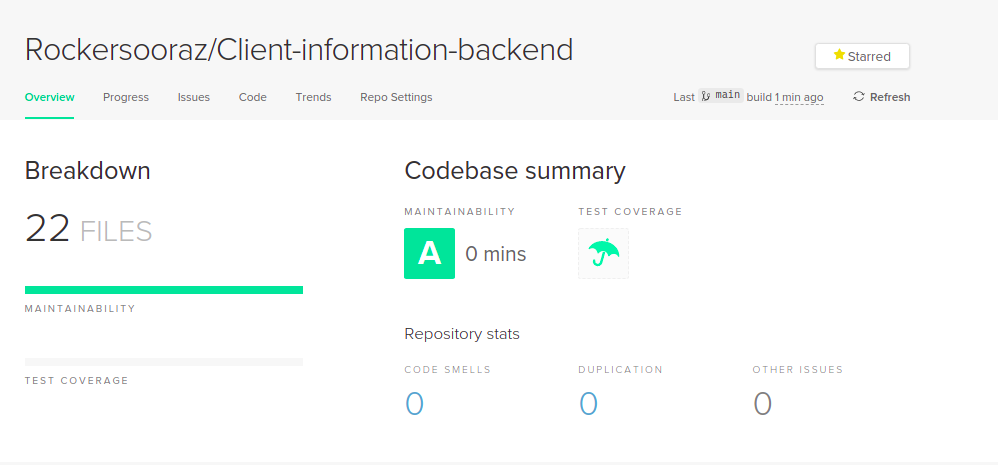

## Introduction

This is an application written in  Typescript Nest framework.This app comprises the rest api for the CRUD operation of the clients with proper validation.


## Features and use of Library(npm only)

1. Csv-Parser
2. Validation
3. Api-Documentation
4. Pagination
5. Docker

## Use of Library(npm only) and Purpose of use

1. csv-writer - To store the client pulled from UI as csv file.
2. csvtojson  - To return the well formated JSON to the client application upon request from stored csv file.
3. class-validator - For validation of the input field
4. nestjs/swagger - For the documentation of api

## Deployment
 This app is hosted in heroku named as [Client-information-task](https://client-information-task.herokuapp.com).
 Api can be tested on this [link](https://client-information-task.herokuapp.com/api/v1/client-details)

## Docker
 This app comprises Dockerfile to build docker image and docker-compose to run the application via docker.Make sure to build the image and replace the built image in docker-compose file and run ```docker-compose up```.
Also you can pull the docker image from docker-hub via command ```docker pull 84272/dockerized-nest-app:1.0.0```

## Code Quality Checking

This Github repository has been scanned through codeclimate and following result was obtained.


## Installation

```bash
$ npm install
```

## Running the app

```bash
# development
$ npm run start

# watch mode
$ npm run start:dev

# production mode
$ npm run start:prod
```

## Stay in touch

- Author - [Suraj Adhikari]()
- LinkedIn - [@surajadhikari](https://www.linkedin.com/in/surajadhikari98/)

